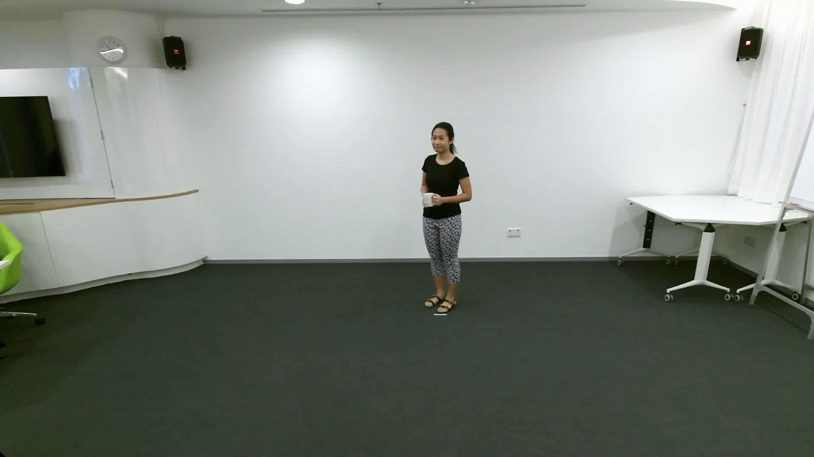
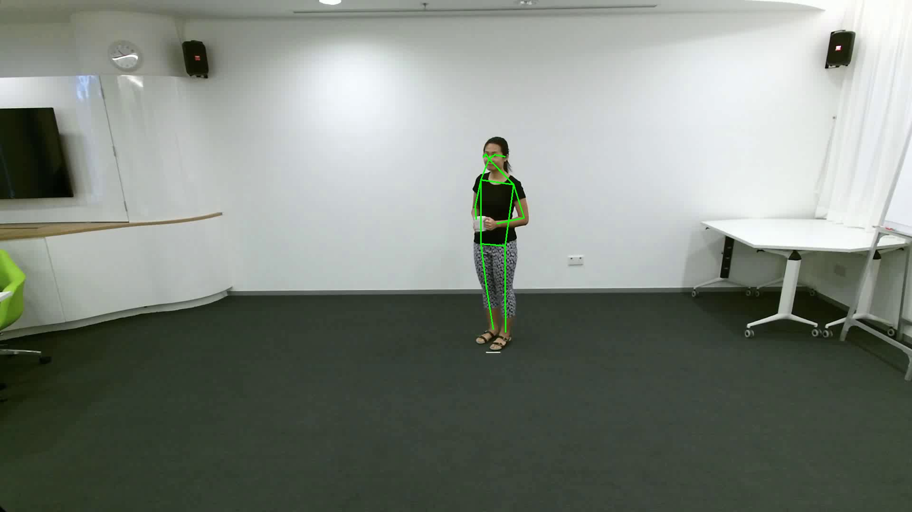

# Download Weights
1. Download pretrained weights from [Google](https://drive.google.com/file/d/1MtljnHRv9R6F1ixMfIS0nqvLDyL2fe8a/view?usp=sharing)
2. Unzip and move
```
unzip SimCC_Pose_weights.zip
mv SimCC_Pose_weights/hrnet_w32-36af842e.pth ./pretrained
mv SimCC_Pose_weights/pose_hrnet_w48_256x192_split2_sigma4.pth ./pretrained
mv SimCC_Pose_weights/yolov5m.pt ./pretrained
mv SimCC_Pose_weights/fast_res50_256x192.pth ./models/sppe
mv SimCC_Pose_weights/fast_res101_320x256.pth ./models/sppe
```

# Test Demo
```
python main.py
```
<div align=center>


</div>
