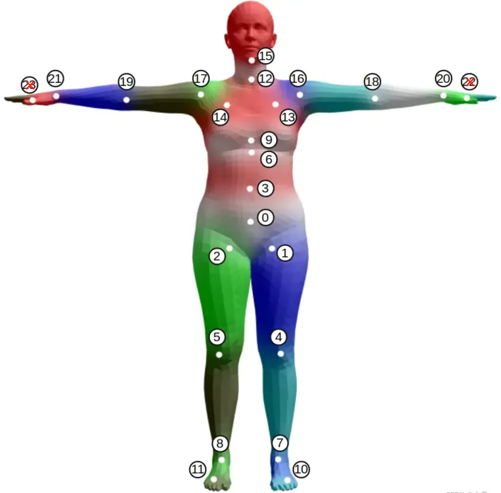
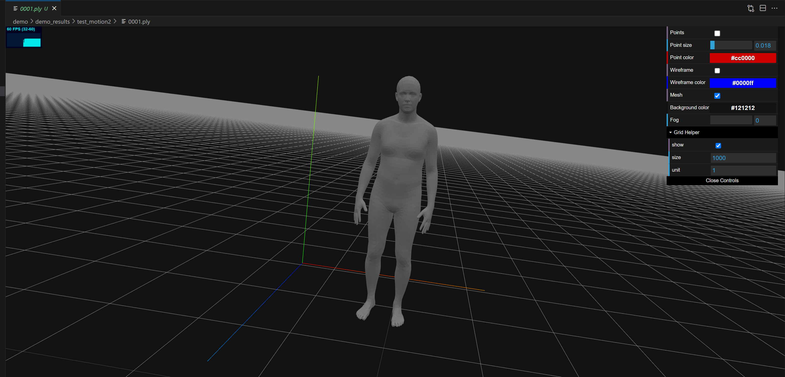

# Use 22 pose joints to visualize SMPL 3D map
# Run
1. Put your pose data (22 joints) into ```./demo/demo_data/```
2. Run ```python fit_seq_ljf.py --files [your_pose_data.npy]```

# Visualization
Origin pose data (22 joints): 
<div align=center>

</div>
Generated SMPL map:
<div align=center>

</div>

# Reference
Our code is based on [joints2smpl](https://github.com/wangsen1312/joints2smpl)
